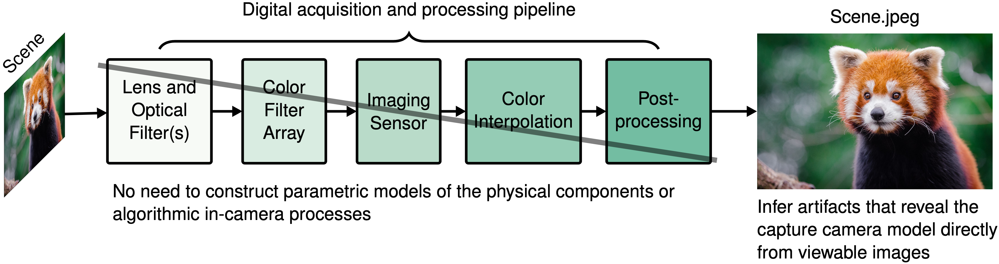
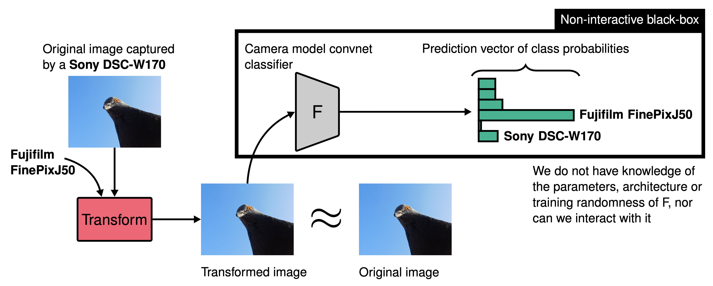
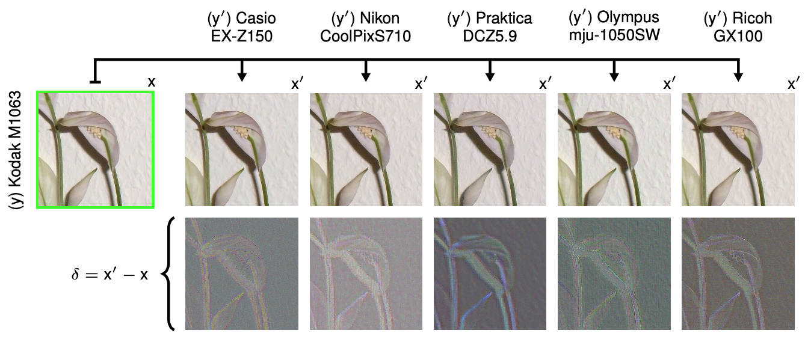
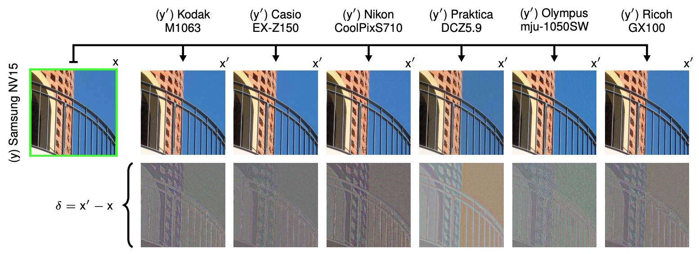
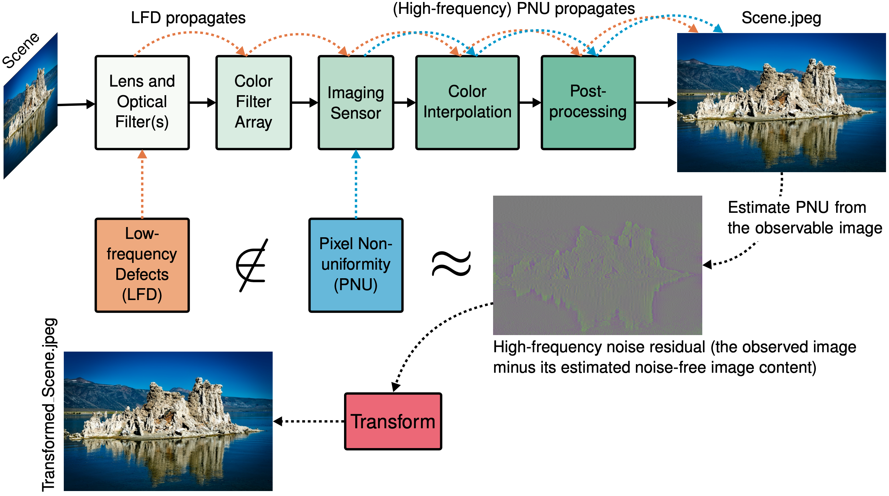
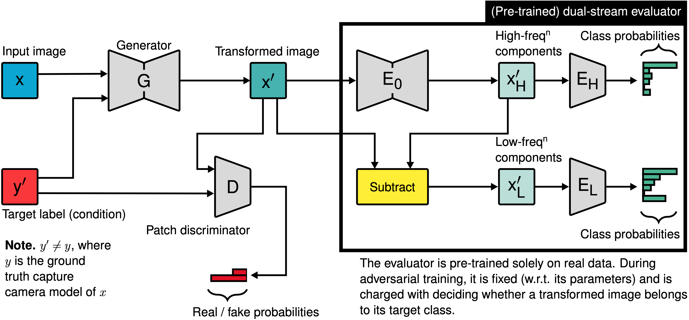
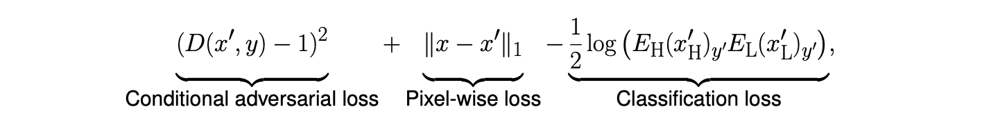
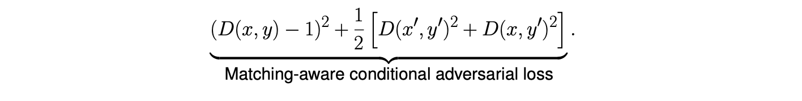

# Conditional Adversarial Camera Model Anonymization

PyTorch implementation of [Conditional Adversarial Camera Model Anonymization](https://arxiv.org/abs/2002.07798) (ECCV 2020 Advances in Image Manipulation Workshop).

## Problem description
### Camera model attribution
Digital photographs can be **blindly** attributed to the specific camera model used for capture.

<p align="center"></p>

### Camera model anonymization
Conditional Adversarial Camera Model Anonymization (Cama) offers a way to preserve privacy by transforming these artifacts such that the apparent capture model is changed (targeted transformation). That is, given an image and a target label condition, the applied transformation causes a non-interactive black-box *target* (i.e. to be attacked/fooled) convnet classifier  to predict the target label given the transformed image. While at the same time retaining the original image content.

However, Cama is trained in a **non-interactive black-box setting**: Cama does not have knowledge of the parameters, architecture or training randomness of , nor can Cama interact with it. 

<p align="center"></p>

#### Anonymizing in-distribution images
Cama is able to successfully perform targeted transformations on in-distribution images (i.e. images captured by camera models known to it).

Example (below) of Cama transformed images  with different target label conditions  given an in-distribution input image  (whose ground truth label is ). The applied transformations (amplified for visualization purposes) are shown as .

<p align="center"></p>

#### Anonymizing out-of-distribution images
Cama is also able to successfully perform targeted transformations on out-of-distribution images (i.e. images captured by camera models unknown to it).

Example (below) of Cama transformed images  with different target label conditions  given an out-of-distribution input image  (whose ground truth label is ). The applied transformations (amplified for visualization purposes) are shown as .

<p align="center"></p>

### Previous approaches to camera model anonymization
Previous works view anonymisation as requiring the transformation of pixel non-uniformity (PNU) noise, which is defined as slight variations in the sensitivity of individual pixel sensors. Although initially device-specific, these variations propagate nonlinearly through a digital camera's processing steps that result in the viewable image, and thus end up also depending on model-specific aspects.

Model anonymization approaches based on PNU suppress the image content, using a denoising filter, and instead work with the noise residual, i.e. the observed image minus the estimated noise-free image content.
This is premised on improving the signal-to-noise ratio between the model-specific artifacts, i.e. the signal of interest, and the observable image. However, this precludes any anonymization process from attending to discriminative low spatial frequency model-specific artifacts, since they no longer exist within the high-frequency noise residual. 

<p align="center"></p>

## Cama architecture description
We denote by  and  an image and its ground truth (source) camera model label, respectively, sampled from a dataset . Consider a *target* (i.e. to be attacked) convnet classifier  with  classes trained over input-output tuples . Given ,  outputs a prediction vector of class probabilities .

As aforementioned, Cama operates in a **non-interactive black-box setting**. We do, however, assume that Cama can sample from a dataset similar to , which we denote by . Precisely, Cama can sample tuples of the following form:  s.t. , where  s.t. . That is, the set of possible image class labels in  is a superset of the set of possible image class labels in , i.e. .

Suppose  and , where  is a target label. Our aim is to learn a function  s.t. the maximum probability satisfies . This is known as a *targeted* attack, whereas the maximum probability of an *untargeted* attack must satisfy . **Cama performs targeted attacks.**

<p align="center"></p>

Cama has two class conditional components: a generator  that transforms an image  conditioned on a target class label , and a discriminator  that predicts whether the low-level high-frequency pixel value dependency features of any given image conditioned on a label are real or fake. In addition, Cama has a fixed (w.r.t. its parameters) dual-stream discriminative decision-making component  (evaluator) that decides whether a transformed image  belongs to its target class . In essence,  serves as a surrogate for the non-interactive black-box . W.r.t. , a transformed image  is decomposed into its high and low spatial frequency components ( and , respectively), via , with each assigned to a separate stream ( and , respectively). The evaluator then reasons over the information present in  and  separately (via  and , respectively). This reinforces the transformation process, as  is constrained to transform both high and low spatial frequency camera model-specific artifacts used by the evaluator for discrimination.


During conditional adversarial training,  minimizes:

<p align="center"></p>

whereas  minimizes:

<p align="center"></p>


## Getting started
### Dependencies
* Python 3
* CUDA
* [PyTorch](http://pytorch.org/) (1.6.0), [torchvision](https://github.com/pytorch/vision/) (0.7.0), [torchsummary](https://github.com/sksq96/pytorch-summary) (1.5.1), [SciPy](https://www.scipy.org) (1.4.1), [PyWavelets](https://pywavelets.readthedocs.io/en/latest/) (1.1.1), [scikit-image](https://scikit-image.org/) (0.16.2), [pandas](https://pandas.pydata.org) (1.1.3), [requests](https://requests.readthedocs.io/en/master/) (2.24.0), [matplotlib](https://matplotlib.org/) (3.2.1), [NumPy](https://numpy.org/) (1.17.4), [tqdm](https://github.com/tqdm/tqdm/) (4.45.0), [colour-demosaicing](https://pypi.org/project/colour-demosaicing/) (0.1.5), [Pillow](https://pillow.readthedocs.io/en/stable/) (7.2.0)

### Installation
Simply clone this repository:

```bash
git clone https://github.com/jeroneandrews/cama.git
cd cama
pip install -r requirements.txt
```

### Dataset
To download and preprocess the [Dresden image database](http://forensics.inf.tu-dresden.de/ddimgdb/) of JPEG colour images captured by 27 unique camera models run:

```bash
./download.sh
```
(This will also clone the [Perceptual Similarity repository](https://github.com/richzhang/PerceptualSimilarity), which is used for computing the distortion introduced by the camera model anonymization transformation process).

The preprocessed data samples will be saved to the following folders as `.pth` files:
```
data/dataset/dresden_preprocessed/image    # RGB images [4.8GB]
data/dataset/dresden_preprocessed/prnu     # prnus with linear patterns [20GB]
data/dataset/dresden_preprocessed/remosaic # remosaiced RGB images [39GB]
```
Each sample (`.pth` file) is a tensor of size `(3, 512, 512)`. Note that you can change the image size (as well as other parameters) in `data/config.py` file.

Each of the above folders (e.g. `data/dataset/dresden_preprocessed/image`) contain the following subfolders:

* `adversary` (Cama train/validation data)
* `examiner` (non-interactive black-box target classifier train/validation data)
* `test` (in-distribution test data)
* `test_outdist` (out-of-distribution test data)

(Note that the folder `data/dataset/dresden_preprocessed/remosaic` does not have a subfolder `remosaic`, as this type of data is never used by a non-interactive black-box classifier).

The number of unique samples in `adversary`, `examiner`, `test` and `test_outdist` should be 2508, 2463, 600 and 600, respectively. 

### Training
#### Train adversarial / non-interactive black-box PRNU estimators 
```bash
python estimator.py

# main parameters
--user adversary # Dataset (adversary / examiner)
--ptc_sz 64 # Patch width/height
--ptc_fm 3 # Number of input feature maps (channels)
--expanded_cms False # Training with an expanded set of camera models (only valid if user is examiner)

# network architecture
--estimator_output prnu_lp # Estimate prnu_lp, i.e. prnu noise with linear pattern, of an rgb image (prnu_lp)
--nef 64 # Number of feature maps in the first and last convolutional layers
--n_blocks 2 # Number of residual blocks in the estimator
--drop_rate 0 # Dropout rate in the residual blocks

# training parameters
--batch_size 128 # Batch size (training)
--test_batch_size 32 # Batch size (validation / testing)")
--rnd_crops False # Extract patches randomly (True) or from a non-overlapping grid (False)
--n_epochs 90 # Total number of epochs
--n_samples_per_epoch 150000 # Number of training samples per epoch
--optimizer adam_standard,weight_decay=0.0005 # Estimator optimizer (adam_standard,weight_decay=0.0005 / sgd,lr=0.1,weight_decay=0.0005,momentum=0.9,nesterov=True)
--save_opt True # Save optimizer
--lr_milestones [] # Epochs to divide learning rate by 10

# loaders / gpus
--n_workers 10 # Number of workers per data loader
--pin_memory True # Pin memory of data loaders
--gpu_devices 0 # Which gpu devices to use

# reload
--reload "" # Path to a pre-trained estimator (and optimizer if saved)
--resume False # Resume training

# debug
--debug False # Debug mode (only use a subset of the available data)
```


#### Train adversarial evaluators / non-interactive black-box classifiers 
```bash
python classifier.py

# main parameters
--user adversary # Dataset (adversary / examiner)
--ptc_sz 64 # Patch width/height
--ptc_fm 3 # Number of input feature maps (channels)
--expanded_cms False # Training with an expanded set of camera models (only valid if user is examiner)

# network architecture
--clf_input rgb # classifier mode {'prnu', 'prnu_lp', 'image'}
--clf_architecture resnet18 # Classifier architecture (vgg11 / vgg13 / vgg16 / vgg19 / resnet18 / resnet34 / resnet50 / densenet40 / densenet100)
--drop_rate 0.5 # Dropout in the classifier
--efficient False # Memory efficient (but slower) training for DenseNet models

# training parameters
--batch_size 128 # Batch size (training)
--test_batch_size 16 # Batch size (validation / testing)")
--rnd_crops False # Extract patches randomly (True) or from a non-overlapping grid (False)
--n_epochs 90 # Total number of epochs
--n_samples_per_epoch 150000 # Number of training samples per epoch
--optimizer sgd,lr=0.1,weight_decay=0.0005,momentum=0.9,nesterov=True # Classifier optimizer (sgd,lr=0.1,weight_decay=0.0005,momentum=0.9,nesterov=True / adagrad,lr=0.1,lr_decay=0.05)
--save_opt True # Save optimizer
--lr_milestones 45 68 # Epochs to divide learning rate by 10

# loaders / gpus
--n_workers 10 # Number of workers per data loader
--pin_memory True # Pin memory of data loaders
--gpu_devices 0 # Which gpu devices to use

# reload
--reload "" # Path to a pre-trained classifier (and optimizer if saved)
--est_reload "" # Path to a a pre-trained PRNU estimator (trained with estimator.py)
--resume False # Resume training

# debug
--debug False # Debug mode (only use a subset of the available data)
```

#### Train Cama
```bash
python train.py

# main parameters
--ptc_sz 64 # Patch width/height
--ptc_fm 3 # Number of input feature maps (channels)

# generator architecture
--gen_input remosaic # Generator input (rgb / remosaic)
--ngf 64 # Number of feature maps in the generator's first and last convolutional layers
--n_blocks 2 # Number of residual blocks in the generator

# discriminator architecture
--dis_input con_conv # Classifier input (prnu_lp / rgb / con_conv / prnu_lp_low+prnu_lp)
--ndf 64 # Number of feature maps in the discriminator's first convolutional layer 
--use_lsgan True # Least squares GAN
--dis_type patch # Discriminator type (patch / pixel)
--n_dis_layers 2 # Number of discriminator layers (only used if the discriminator is a patch discriminator)
--dis_drop_rate 0 # Dropout in the discriminator

# training parameters
--pixel_loss l1 # Pixel-wise loss (l1 / l2)
--pixel_loss_schedule 10.0, 0 # First argument: pixel loss feedback coefficient (0 to disable). Second argument: epochs to progressively increase the pixel loss coefficient (0 to disable).
--adv_loss_schedule 1.0, 0 # First argument: adversarial loss feedback coefficient (0 to disable). Second argument: epochs to progressively increase the adversarial loss coefficient (0 to disable).
--clf_low_loss_schedule 0.005, 0 # First argument: low-frequency classifier loss feedback coefficient (0 to disable). Second argument: epochs to progressively increase the pixel loss coefficient (0 to disable).
--clf_high_loss_schedule 0.005, 0 # First argument: high-frequency classifier loss feedback coefficient (0 to disable). Second argument: epochs to progressively increase the pixel loss coefficient (0 to disable).
--batch_size 128 # Batch size (training)
--test_batch_size 16 # Batch size (validation)
--rnd_crops False # Extract patches randomly (True) or from a non-overlapping grid (False)
--n_epochs 200 # Total number of epochs
--n_samples_per_epoch 150000 # Number of training samples per epoch
--gen_optimizer adam,lr=0.0002 # Generator optimizer (adam,lr=0.0002)
--dis_optimizer adam,lr=0.0002 # Discriminator optimizer (adam,lr=0.0002)
--save_opt True # Save optimizer
--lr_milestones [] # Epochs to divide learning rate by 10

# visualization parameters
--padding 20 # Amount of padding (in pixels) between images in a single plot

# loaders / gpus
--n_workers 8 # Number of workers per data loader
--pin_memory True # Pin memory of data loaders
--gpu_devices 0 # Which gpu devices to use

# reload
--reload "" # Path to a pre-trained conditional GAN (and optimizer if saved)
--clf_low_reload "" # Path to a pre-trained low-frequency classifier (trained with classifier.py)
--clf_high_reload "" # Path to a pre-trained high-frequency classifier (trained with classifier.py)
--est_reload "" # Path to a a pre-trained PRNU estimator (trained with estimator.py)
--resume False # Resume training

# debug
--debug False # Debug mode (only use a subset of the available data)
```


### Testing
```bash
python test.py

# main parameters
--ptc_fm 3 # Number of input feature maps (channels)

# testing parameters
--test_batch_size 16 # Batch size (testing)
--in_dist True # Are the test images in-distribution, i.e. captured by camera models known to conditional GAN?
--comp_distortion True # Compute the distortion of the generator's outputs?
--quantize False # Perform quantization?

# visualization parameters
--visualize 10 # Number of transformation visualizations to save (0 to disable)
--padding 20 # Amount of padding (in pixels) between images in a single plot

# loaders / gpus
--n_workers 8 # Number of workers per data loader
--pin_memory True # Pin memory of data loaders
--gpu_devices 0 # Which gpu devices to use

# reload
--reload "" # Path to a pre-trained conditional GAN (trained with train.py)
--clf_low_reload "" # Path to a pre-trained low-frequency classifier (trained with classifier.py)
--clf_high_reload "" # Path to a pre-trained high-frequency classifier (trained with classifier.py)
--est_reload "" # Path to a a pre-trained PRNU estimator (trained with estimator.py)
--transformed_imgs_reload "" # Path to pre-computed transformed images '.pth' file
```

